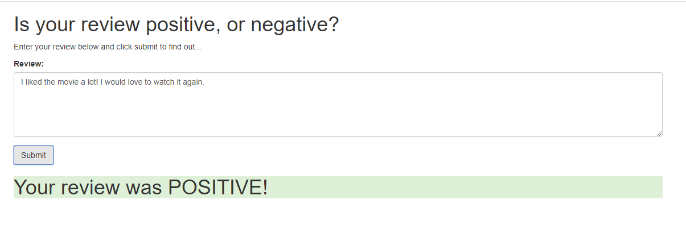
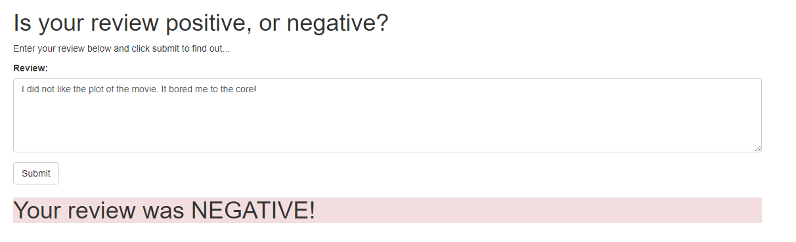
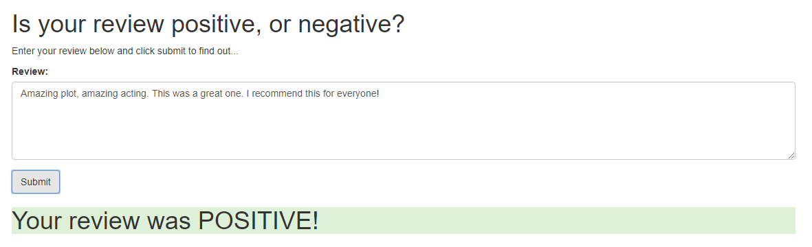

# Machine Learning Engineer Udacity Nanodegree - SageMaker Deployment Project

This repository contains the solution code for the "SageMaker Deployment" project done as a part of Machine Learning Engineer Nanodegree program.

A Sentiment Analysis-LSTM model in PyTorch is trained and deployed using AWS SageMaker, API Gateway and Lambda services. The model is trained on IMDB Sentiment Analysis dataset to perform sentiment analysis on reviews to determine whether a review is positive or negative.

The deployment architecture is shown in the below picture:

The original repository can be found at [Udacity/sagemaker-deployment - Machine Learning Deployment using AWS SageMaker](https://github.com/udacity/sagemaker-deployment)

## Results from Web App

A simple HTML page was used to interact with the API, the results are as follows:

Example review 1:

Example review 2:

Example review 3:

